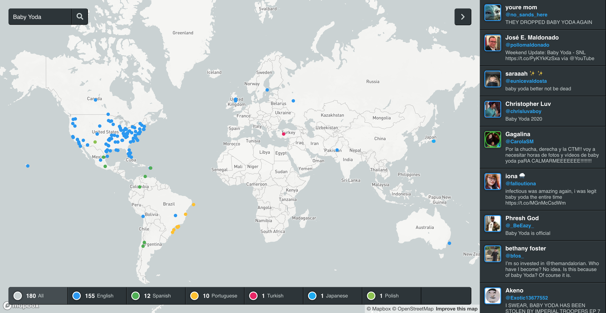

# TweetMap

TweetMap is a React based app which harnesses the power of Twitter's search API as well as Google's geocoding API to visualize recent tweet locations.

[Demo](https://clockworkftw.github.io/tweetmap/)

